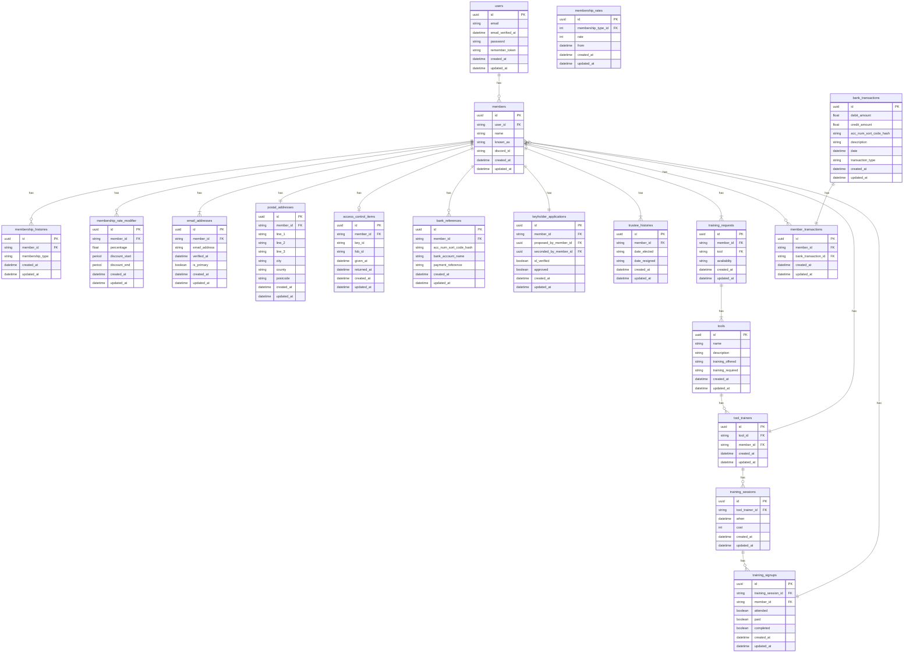

# Database

Bellow is the database schema for the Hackspace Membership Management System. This schema is designed to be used with a MySQL database.

The databse also contains tables defined by laravel and some packages namely which are not shown here ie:
- migrations
- jobs
- roles
- permissions

